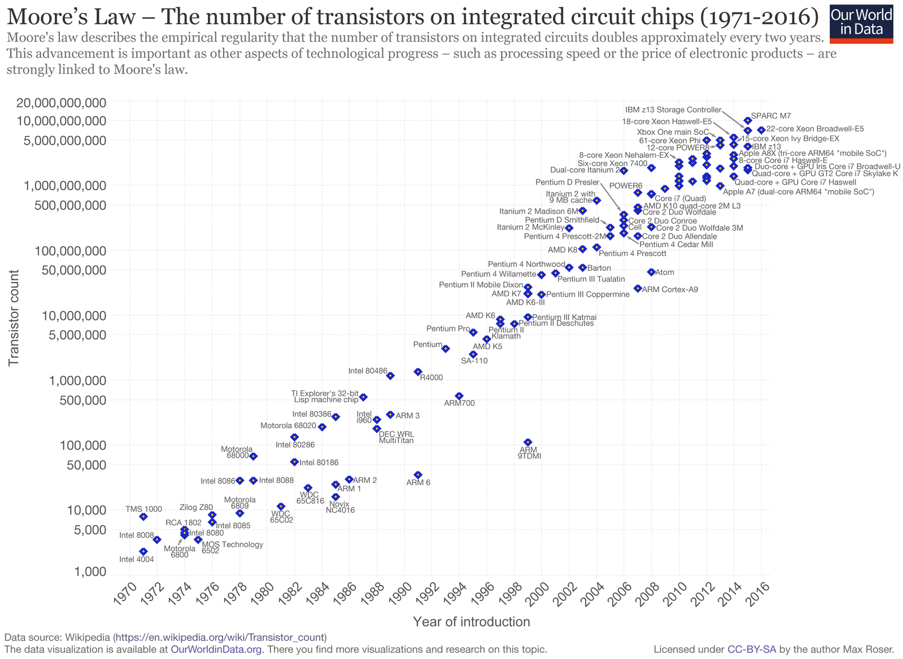
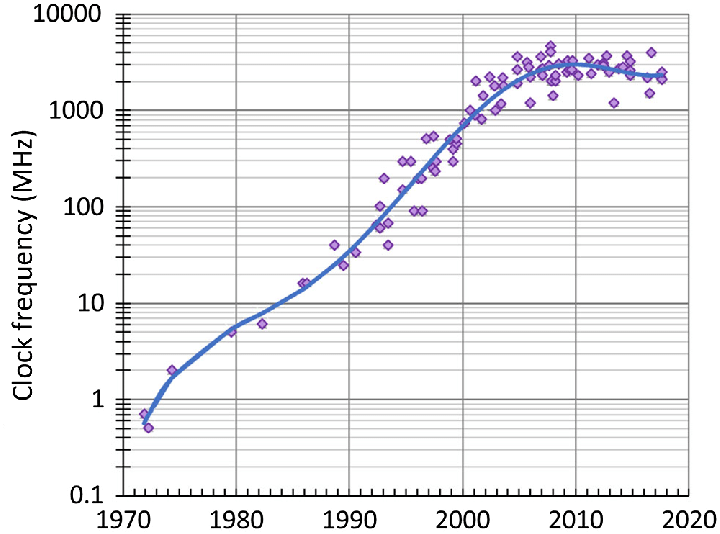
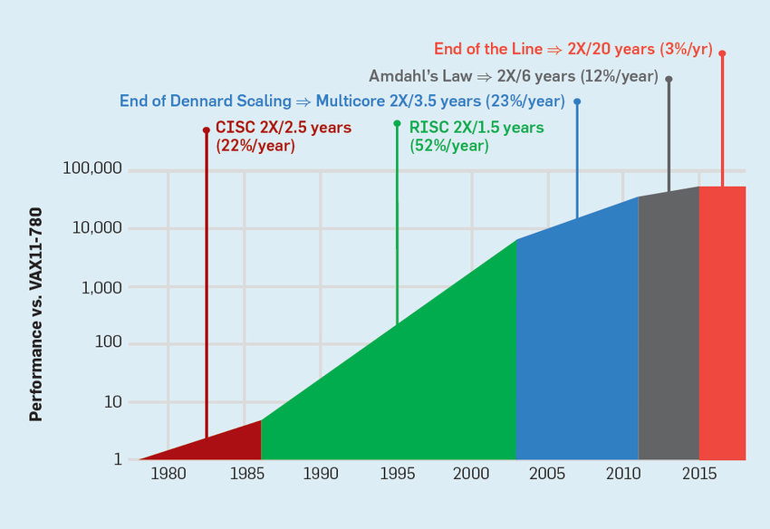
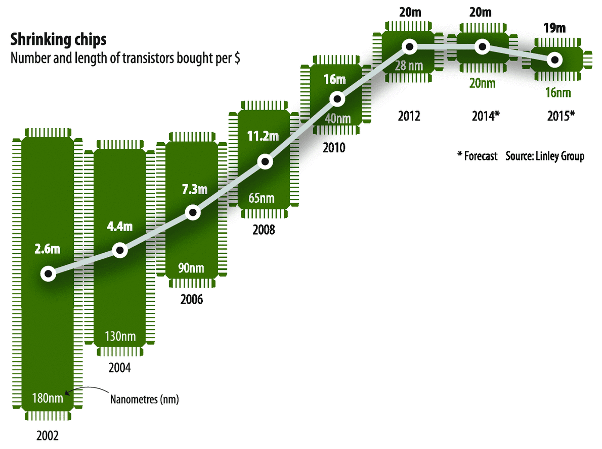
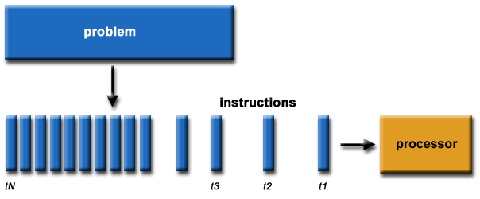
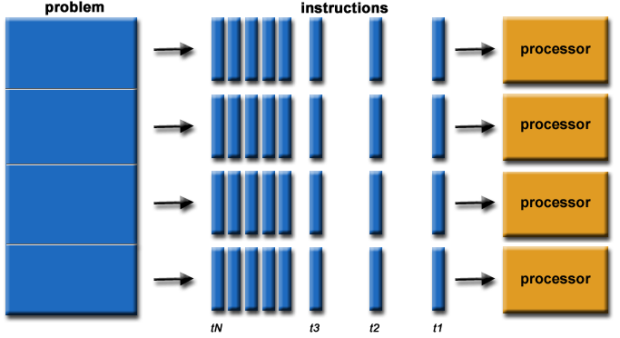
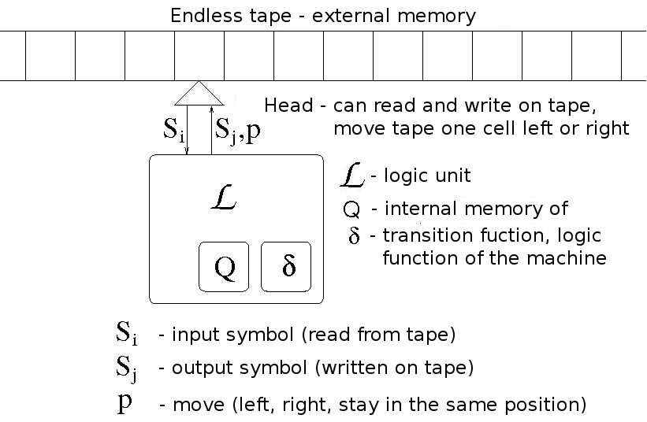
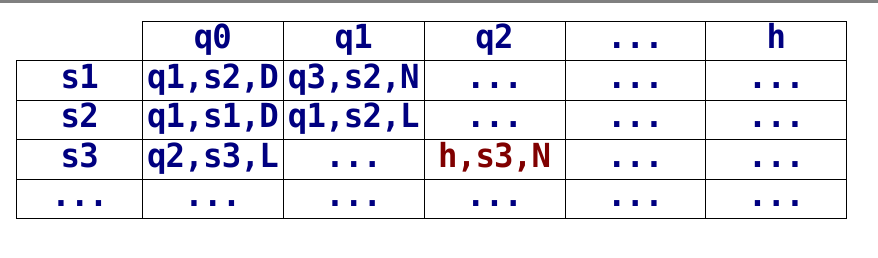
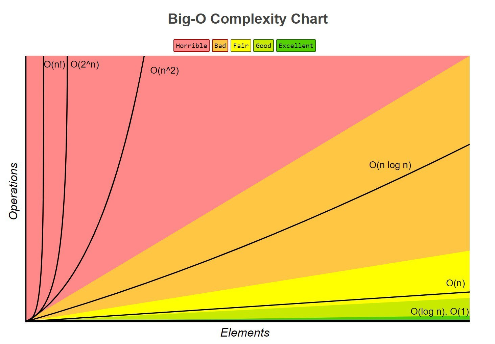
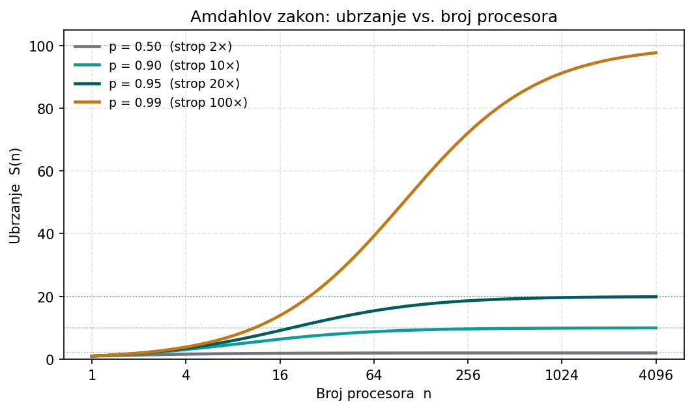

# O kolegiju

## Općenito o kolegiju

```{=latex}
\large
```

- **Predavanja:** prof. dr. sc. Damir Krstinić; doc. dr. sc. Antonia Ivanda
- **Laboratorijske vježbe:** univ. mag. ing. comp. Jakov Bejo
- Način ocjenjivanja definiran je u sustavu *FESB Nastava*

## Sadržaj kolegija

- **Dio I** --- uvod i teorijska razmatranja
- **Dio II** --- arhitekture s dijeljenom memorijom (višenitno programiranje, OpenMP)
- **Dio III** --- arhitekture s distribuiranom memorijom (MPI)
- **Dio IV** --- GPU arhitekture (CUDA)

# Zašto paralelno računanje?

## Motivacija

```{=latex}
\large
```

- Cilj: riješiti problem **brže** nego serijskim (slijednim) računanjem

- Može li rast računalne snage pratiti sve zahtjevnije probleme?

- **FLOPS** --- *Floating Point Operations per Second*:
    - 1950.: oko $10^{2}$ FLOPS
    - danas: preko $10^{18}$ FLOPS (eksaskala)

\vspace{1.5ex}

\begin{deklaracija}
\textbf{Mooreov zakon:} broj tranzistora u integriranom krugu udvostručuje se otprilike svake dvije godine.
\end{deklaracija}

## Gordon Moore --- izvorni zakon i revizija

```{=latex}
\large
```

- **1965.** --- Moore predviđa udvostručenje broja komponenti po integriranom krugu **svake godine**
    - trend počinje izumom integriranog kruga 1958.
- **1975.** --- revidira prognozu: udvostručenje **svake dvije godine**

## {.plain}

{height=82%}

## Fizikalni limiti brzine

- Brzina računala određena je trajanjem jednog **ciklusa**
- Trajanje ciklusa ograničeno je fizikom:
    - brzina svjetlosti: $3\cdot10^{8}$ m/s (≈ 30 cm/ns)
    - brzina signala u bakrenom vodiču: ≈ 9 cm/ns
- Frekvencija procesora prestala je rasti --- dolazimo do **zida** frekvencije i snage

## Frekvencija procesora kroz vrijeme

{width=100% height=84%}

## Kraj Dennardovog skaliranja

- **Dennardovo skaliranje (1974.):** kako se tranzistori smanjuju, gustoća snage ostaje ista --- svaka generacija brža uz jednaku potrošnju
- Prestaje vrijediti oko **2005.**: pri malim dimenzijama rastu struje curenja i gustoća topline (*power wall*)
- Frekvencija se više ne može dizati bez pregrijavanja
- Odgovor: umjesto brže jezgre --- **više jezgara** (na grafu prijelaz na „Multicore 2×/3,5 g.")
- Amdahlov zakon ograničava korist paralelizma → „End of the Line" (2×/20 g.)
- Rast performansi sada dolazi iz **paralelizma i arhitekture**, ne iz frekvencije

## {.plain}

{height=80%}

## Granice minijaturizacije

- Osim brzine, ograničen je i **broj tranzistora** na pločici
- Tranzistori se smanjuju do razmjera **nanometara**:
    - današnji proizvodni procesi reda su nekoliko nm
    - vrata tranzistora široka su tek desetak atoma (atom silicija ≈ 0,2 nm)
- Na tim razmjerima javljaju se **kvantni efekti**:
    - tuneliranje elektrona → struja curenja
    - porast gustoće topline
- Fizička veličina atoma i vodiča postavlja **donju granicu** --- Mooreov zakon usporava
- Dobitak se zato sve više traži u **paralelizmu**, a ne u sve manjim tranzistorima

## {.plain}

{height=80%}

## Cijena po tranzistoru više ne pada

- Mooreov zakon dugo je značio i **pad cijene** po tranzistoru --- više tranzistora za isti novac
- Broj tranzistora po dolaru rastao je do ~**2012.** (28 nm), zatim stagnira i blago pada (20 nm, 16 nm)
- Manji čvorovi (nm) sve su **skuplji** za proizvodnju --- ekonomska korist nestaje
- Mooreov zakon usporava **tehnički i ekonomski**
- Minijaturizacija više nije „besplatan" izvor ubrzanja --- glavni put postaje **paralelizam**

## Odgovor: korištenje višestrukih resursa

- Paralelizacija na razini **sklopovlja**:
    - višejezgreni procesori (dual / quad / octa / …)
    - pipelining, hyperthreading, FPGA, GPU
- Korištenje **višestrukog** sklopovlja:
    - *cluster* --- homogeno sklopovlje
    - *grid* --- heterogeno, prostorno distribuirano
    - *cloud* --- klijent/poslužitelj, visoka dostupnost usluga

# Serijsko i paralelno računanje

## Serijsko (slijedno) računanje

- Problem se rastavlja na male diskretne korake
    - svaki korak opisuje se jednostavnom instrukcijom
- Instrukcije se odvijaju u nizu, jedna za drugom --- nijedna se ne izvršava dok prethodna nije završila
- Izvršavaju se na **jednom procesoru** --- u svakom trenutku samo jedna instrukcija
- Pri tome **nije važna programska paradigma** (npr. proceduralno vs. objektno orijentirano)

## Serijsko (slijedno) računanje

- Problem se rastavlja na male diskretne korake
    - svaki korak opisuje se jednostavnom instrukcijom
- Instrukcije se odvijaju u nizu, jedna za drugom --- nijedna dok prethodna nije završila
- Izvršavaju se na **jednom procesoru** --- u svakom trenutku samo jedna instrukcija

{width=66%}

## Paralelno računanje

- Istovremeno korištenje **višestrukih resursa** za brže (efikasnije) rješavanje složenih problema
- Problem se rastavlja na dijelove koji se izvršavaju **istovremeno**
- Svaki dio dalje se rastavlja na male diskretne korake
    - svaki korak opisuje se jednostavnom instrukcijom
    - instrukcije se odvijaju u nizu, jedna za drugom --- nijedna dok prethodna nije završila

## Paralelno računanje

- Istovremeno korištenje **višestrukih resursa** za brže (efikasnije) rješavanje složenih problema
- Problem se rastavlja na dijelove koji se izvršavaju **istovremeno**
- Svaki dio dalje se rastavlja na male diskretne korake

{height=50%}

## Paralelno računanje

- Rasčlanjivanje složenih postupaka (problema) na jednostavnije dijelove koji se mogu izvršavati istovremeno na višestrukim računalnim resursima
- Manji i jednostavniji dijelovi problema često dijele isti ili sličan kod
- Dijelovi koji se izvršavaju istovremeno međusobno **komuniciraju**:
    - putem zajedničke (dijeljene) memorije
    - razmjenom poruka
- Po završetku se rezultati **kombiniraju** za dobivanje konačnog rezultata

# Znanje, algoritmi i složenost

## Mogu li računala riješiti sve?

- Cilj: pronalaženje rješenja problema u što **kraćem vremenu**
- Mogu li računala postati dovoljno snažna (i brza) za rješavanje **svih** problema?
    - usvajanjem novih znanja nastaju nova pitanja i zahtjevi za većom računalnom moći
    - računala nikad neće biti dovoljno snažna za **sve** računske probleme
- Mogu li postati dovoljno snažna da riješe sve **postojeće** probleme?

## Znanje i rješavanje problema

- **Deklarativno znanje:**
    - poznavanje, svijest ili razumijevanje stečeno učenjem ili iskustvom
    - zbir svega opaženog, otkrivenog ili naučenog
    - „jabuka je voće"
    - „y je kvadratni korijen iz x samo ako je y·y = x"

## Znanje i rješavanje problema

- **Deklarativno znanje** --- činjenice (što je istina):
    - „jabuka je voće"; „y je korijen iz x ako je y·y = x"
- **Imperativno (proceduralno) znanje:**
    - znanje koje se koristi u rješavanju zadataka --- *kako* se zadatak rješava (recept)
    - često ga je teško opisati
    - velik dio usvajamo a da nismo toga svjesni

## Rješavanje problema

- Smatra se najsloženijom intelektualnom funkcijom --- kognitivni proces višeg reda koji traži kontrolu više temeljnih vještina
- **Matematičko rješavanje problema:**
    - iz početnih uvjeta (ulazni podaci) → niz koraka (**algoritam**) → željeni konačni uvjeti (izlazni podaci)

## Algoritam

- **Problem:** zadatak koji treba riješiti
- **Alat:** uređaj ili tehnika sa skupom primitivnih operacija koje podržava

\vspace{1.5ex}

\begin{deklaracija}
{\large \textbf{Algoritam} predstavlja konačnu i jasno definiranu eksplicitnu kombinaciju primitivnih operacija koje alat podržava, a koje se izvršavaju određenim redoslijedom da bi se od početnih uvjeta došlo do konačnih uvjeta.}
\end{deklaracija}

## Računalni alati

- Računalne probleme rješavamo dostupnim **alatima**:
    - štapići i kamenčići
    - olovka i papir
    - abakus (2500. prije nove ere)
    - šiber
    - digitalno računalo
    - kvantno računalo?

## Računalni alati

- Svaki alat ima svoj skup **primitivnih operacija**
- Operacije se kombiniraju na različite načine za izvođenje algoritma
- Primjer --- alat: **ravnalo i šestar**
    - ravnalo: crtanje ravne crte, mjerenje dužine
    - šestar: crtanje kružnica i lukova
- Omogućava li napredniji alat jednostavnije rješavanje problema?

## Turingov stroj

{height=84%}

## Turingov stroj

- Hipotetski uređaj koji mehanički manipulira simbolima na traci prema tablici pravila
- Princip rada:
    - čita simbol ispod glave za čitanje/pisanje
    - prema simbolu i internom stanju zapisuje novi simbol, mijenja stanje i pomiče glavu
    - zaustavlja se u zaustavnom stanju
- **Church-Turingova teza:** izračunljive su točno one funkcije koje su Turing-izračunljive
    - Turingov stroj simulira logiku modernih računala

## Turingov stroj

- **Kako opisujemo algoritam (program) Turingovog stroja?**
    - logička funkcija definirana **tablicom prijelaza stanja**
    - preslikavanje $\delta:(S_i, Q_i) \rightarrow (S_j, P, Q_j)$

{width=78%}

## Algoritam

- **Konačnost:** konačan broj koraka --- dolazi u zaustavno stanje
- **Definitivnost:** točno određen skup ulaznih i izlaznih vrijednosti
- **Nedvosmislenost:** precizno definiran skup i redoslijed operacija
- **Kompleksnost:** mjera složenosti izvršavanja (vremenska, memorijska, energetska …)

## Kompleksnost (složenost) algoritma

- Analiza složenosti = određivanje **količine resursa** za izvršavanje algoritma
- **Vremenska složenost:** vrijeme kao funkcija veličine ulaznog skupa
- **Memorijska složenost:** memorijski prostor kao funkcija veličine ulaznog skupa

## Kompleksnost (složenost) algoritma

- Kako izmjeriti i kvantificirati složenost?
- **Vremenska složenost:**
    - možemo li je procijeniti mjerenjem vremena izvršavanja?

## Kompleksnost (složenost) algoritma

- Kako izmjeriti i kvantificirati složenost?
- **Vremenska složenost** --- mjerenjem vremena?
    - koje vrijeme očekujemo na **drugom računalu**?
    - koje vrijeme očekujemo s **drugim** (većim ili manjim) skupom ulaznih podataka?
- **Memorijska složenost:**
    - količina memorije kao funkcija veličine ulaznog skupa
    - i ovdje promatramo ovisnost o veličini ulaza, ne apsolutnu vrijednost

## Kompleksnost --- primjer: bubble sort

```matlab
function A = bubbleSort(A)
  N = length(A);        % duljina niza
  for i = N:-1:1        % petlja kroz sve brojeve
    for j = 1:i-1       % unutarnja petlja
      if A(j) > A(j+1)  % ako je iduci manji
        tmp = A(j);     % zamijeni uzastopne
        A(j) = A(j+1);
        A(j+1) = tmp;
      end
    end
  end                   % zaustavno stanje
```

## Kompleksnost --- bubble sort

Ako sortiranje 100 brojeva traje 5 s, koliko traje za 200 brojeva?

```matlab
function A = bubbleSort(A)
  N = length(A);        % duljina niza
  for i = N:-1:1        % petlja kroz sve brojeve
    for j = 1:i-1       % unutarnja petlja
      if A(j) > A(j+1)  % ako je iduci manji
        tmp = A(j); A(j) = A(j+1); A(j+1) = tmp;
      end
    end
  end
```

## Kompleksnost --- broj operacija

```matlab
function A = bubbleSort(A)
  N = length(A);        % N
  for i = N:-1:1        % (N-1)+(N-2)+... = N(N-1)/2
    for j = 1:i-1       % broj zamjena ovisi o
      if A(j) > A(j+1)  % inicijalnom redoslijedu brojeva
        tmp = A(j); A(j) = A(j+1); A(j+1) = tmp;
      end
    end
  end
```

## Kompleksnost --- broj operacija

- Ukupan broj operacija proporcionalan je s $N^{2}$ (ne može se točno predvidjeti)

```matlab
function A = bubbleSort(A)
  N = length(A);        % N
  for i = N:-1:1        % (N-1)+(N-2)+... = N(N-1)/2
    for j = 1:i-1
      if A(j) > A(j+1)  % broj zamjena ovisi o redoslijedu
        tmp = A(j); A(j) = A(j+1); A(j+1) = tmp;
      end
    end
  end
```

## Vremenska složenost Bubble sort algoritma

- Očekivano vrijeme izvršavanja:
    - N = 100: **5 s**
    - N = 200: **20 s** (4× duže)
    - N = 300: **45 s** (9× duže)

## Big-O notacija --- mjera složenosti

- Pojednostavljena analiza složenosti algoritma:
    - definira složenost u odnosu na kardinalnost ulaznog skupa $N$
    - **neovisna o sklopovlju** (*machine-independent*) --- procjenjuje sam algoritam
- Razlikujemo vremensku (*time*) i memorijsku (*space*) složenost

## Big-O notacija --- što mjeriti?

- **Najgori slučaj** (*worst-case*)
- **Najbolji slučaj** (*best-case*)
- **Prosječna složenost** (*average-case*)
- U pravilu promatramo **najgori slučaj**; ostali su korisni jer u praksi ovisi o aplikaciji

## Big-O notacija --- osnovna pravila

- Konstante se zanemaruju: $O(9N) \rightarrow O(N)$
- Zanemaruju se članovi nižeg reda
- Poredak klasa:

$$O(1) < O(\log N) < O(N) < O(N\log N) < O(N^{2}) < O(2^{N}) < O(N!)$$

## Klase složenosti: konstantno vrijeme

Zadatak: izračunaj sumu **prvog i zadnjeg** elementa niza

```python
s = A[0] + A[N-1]   # O(1)
```

- **O(1)** --- vrijeme ne ovisi o veličini niza N

## Klase složenosti: linearno vrijeme

Zadatak: izračunaj sumu **svih** elemenata niza

```python
s = 0                 # O(1)
for i in range(N):    # N * O(1)
    s += A[i]
print(s)              # O(1)
```

- O(1) + N · O(1) + O(1) → **O(N)**

## Klase složenosti: kvadratno vrijeme

```python
z = 0
h = 0
for x in range(N):          # N * O(1)
    h += x
    for y in range(N):      # N^2 * O(1)
        z += x * y
print(h)
print(z)
```

- N · O(1) + N² · O(1) → **O(N²)**

## Klase složenosti

{width=100% height=84%}

## Možemo li beskonačno ubrzavati?

- Ako posao podijelimo na više procesora, možemo li ubrzanje povećavati **bez granice**?
- Dodavanjem sve više procesora ($n \rightarrow \infty$) --- teži li vrijeme izvođenja nuli?
- Oznake: **n** = broj procesora,  **N** = veličina problema

## Amdahlov zakon

- $p$ --- udio programa koji se može **paralelizirati**
- $(1-p)$ --- nužno **serijski** dio (ne ubrzava se paralelizacijom)
- Uz $n$ procesora najveće je ubrzanje:

$$S(n) = \frac{1}{(1-p) + \dfrac{p}{n}}$$

## Amdahlov zakon --- granica

- Kad $n \rightarrow \infty$, član $\dfrac{p}{n} \rightarrow 0$:

$$S_{\max} = \lim_{n \to \infty} S(n) = \frac{1}{1-p}$$

- Ubrzanje je **ograničeno serijskim dijelom**, bez obzira na broj procesora:
    - 10 % serijski ($p = 0{,}9$) → najviše **10×**
    - 1 % serijski ($p = 0{,}99$) → najviše **100×**

## Amdahlov zakon --- ubrzanje

{height=80%}

## Zašto se paralelizacija ipak isplati?

- **Nema alternative** --- pojedinačna jezgra se više ne može bitno ubrzati (kraj Dennardovog skaliranja)
- **Veći problemi** (Gustafsonov zakon): s više resursa rješavamo veće probleme; paralelni dio raste → ubrzanje gotovo linearno
- **Mnogi problemi imaju $p \approx 1$** (grafika, matrice, ML, Monte Carlo) → strop u tisućama (zato GPU)
- **Serijski dio se može smanjiti** boljim algoritmom
- **Propusnost:** više nezavisnih zadataka istovremeno → gotovo linearan dobitak

# Sažetak

## Ključne poruke

- Serijska brzina je fizikalno ograničena → budućnost je **paralelizam**
- Paralelno = istovremeno korištenje više resursa + komunikacija + kombiniranje
- Složenost algoritma (Big-O) određuje isplati li se i kako paralelizirati

## Što slijedi i zadaci

- Sljedeće predavanje: **paralelna računala i arhitekture** (Flynnova taksonomija, memorijski modeli)
- Zadatak za samostalni rad --- odredi klasu složenosti za:
    - izračun sume niza
    - izračun sume prvog i posljednjeg elementa niza
