# Modeli paralelnog računanja

## Paralelno računalo

- Više procesorskih (računalnih) jedinica
    - više jezgri / procesora / računala
- Veza među računalnim jedinicama
    - sabirnica, mreža
- Arhitektura paralelnog računala
- Okruženje za razvoj i izvršavanje paralelnog algoritma
    - operativni sustav, razvojno okruženje
- Paralelni algoritam (i odgovarajući program pripremljen za arhitekturu koju koristimo)

## Flynnova taksonomija (1966.)

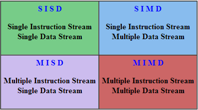{height=70%}

## SISD

- **Von Neumannov model** računala (1946.)
- Jedan procesor, jedna memorijska jedinica
- Jedna instrukcija obrađuje jedan podatak
- Slijedno (serijsko) izvršavanje

\begin{center}
\includegraphics[height=0.40\textheight]{slike/l2s05_1.png}\hspace{1.5em}\includegraphics[height=0.40\textheight]{slike/l2s05_2.png}

{\scriptsize\itshape\color{fesbSiva}Izvor: Wikipedia}
\end{center}

## SIMD

**Podatkovni paralelizam** (*data-level parallelism*)

- Polje jednakih procesora
- Ista instrukcija izvodi se istovremeno na svim procesorima, nad **različitim** podacima
- Procesori rade sinkronizirano
- Primjena: vektorska obrada (jednolika); problem: grananje

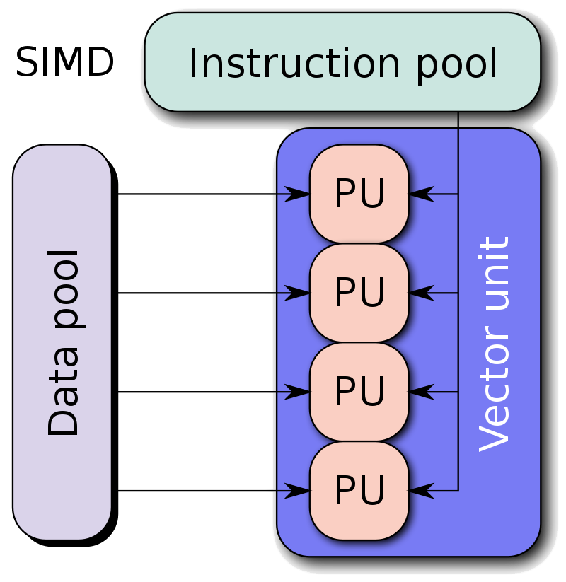{height=40%}

## SIMD --- izvedbe: array processor

- **Array processor** --- vektorske (podatkovne) operacije
    - polje jednakih jedinica izvršava istu operaciju nad različitim elementima
    - ILLIAC IV (1966.); vektorska superračunala od 1970-ih

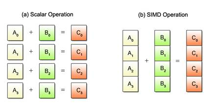{height=48%}

## SIMD --- izvedbe: pipelined processor

- **Pipelined (protočni) processor** --- register-based SIMD
    - prima jednu instrukciju, čita set podataka iz centralne memorije
    - obrada je podijeljena na faze koje se preklapaju kroz cikluse

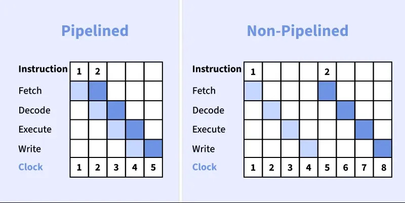{width=66%}

## SIMD --- izvedbe: asocijativni processor

- **Asocijativni processor** (*Associative / Content-Addressable Processor*) --- podacima pristupa preko njihovog **sadržaja**, a ne preko memorijske adrese
- **Paralelno pretraživanje** --- cijeli memorijski prostor pretražuje se u **jednom taktu**, umjesto „stavku po stavku"
- **Asocijativna memorija (CAM)** --- *Content-Addressable Memory*; svaka ćelija ima ugrađenu logiku za usporedbu podataka
- **Prednosti:** brzina, masivni paralelizam
- **Nedostaci:** cijena, potrošnja energije, manji kapacitet memorije

## SIMD --- vektorski primjer

**Skalarno (sekvencijalno) --- 8 ciklusa:** `A[i] + B[i] = C[i]`

{height=26%}

**SIMD (paralelno) --- 1 ciklus:** `A[0..7] + B[0..7] = C[0..7]` --- sve istovremeno!

{height=26%}

## SIMD divergencija

- Problem: **divergentno izvršavanje** (grananje)

```c
forall (int i from 0 to 8) {
    if (x[i] > 0)
        y[i] = x[i] * x[i];   // MUL operacija
    else
        y[i] = x[i] + 100;    // ADD operacija
}
```

- **Problem:** različiti ALU-ovi trebaju izvršiti **različite** instrukcije
- **Rješenje:** SIMD mora izvršiti **obje grane sekvencijalno**

## SIMD --- masking

:::::: columns
::: {.column width="58%"}
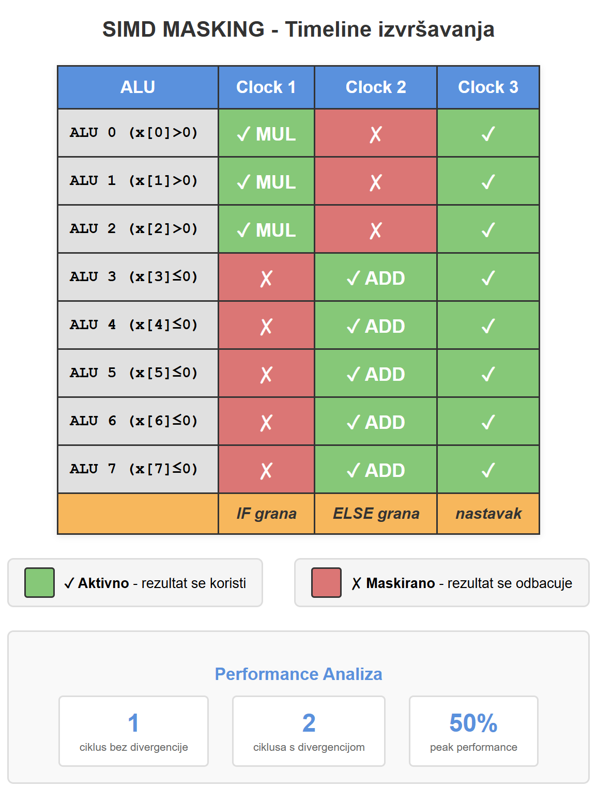{height=76%}
:::
::: {.column width="40%"}
\vspace{4em}

- 1 ciklus bez divergencije (optimalno)
- 2 ciklusa s divergencijom (**50% peak performance**)
:::
::::::

## SIMD --- najgori slučaj

```c
forall (int i from 0 to 8) {
    if (i == 0) {
        // 10 instrukcija, samo za prvi element!
        y[i] = complex_calculation(x[i]);
    }
}
```

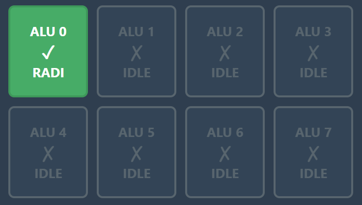{height=30%}

- Performance: **12,5 % = 1/8 peak**

## SIMD

**Loše za SIMD**

- puno IF/ELSE grananja
- nepravilne strukture (grafovi, stabla)
- neujednačeni podaci, različita grananja

\vspace{1ex}

**Dobro za SIMD**

- grafika (pikseli), matrice (jednolika obrada)
- audio obrada
- uniformni podaci, bez/malo grananja

## MISD

**Paralelizam na razini operacije**

:::::: columns
::: {.column width="56%"}
- niz primitivnih operacija složenih u grupe koje se izvršavaju istovremeno nad **istim** podacima
- Primjena:
    - pipeline arhitekture
    - replikacija zadataka (*task replication*)
- Problem:
    - složena implementacija
- primjer: *Space Shuttle* flight control
:::
::: {.column width="42%"}
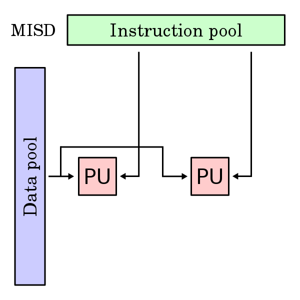{width=98%}
:::
::::::

## MIMD

**Izvršavanje različitih operacija na različitim skupovima podataka**

:::::: columns
::: {.column width="56%"}
- više procesorskih jedinica izvršava **nezavisne** sljedove operacija na različitim podacima
- zadaćni paralelizam
- visoka fleksibilnost i efikasnost
- ključna komponenta modernih računalnih arhitektura
:::
::: {.column width="42%"}
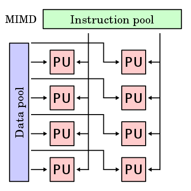{width=98%}
:::
::::::

## MIMD

- Koristi se za širok spektar aplikacija (ne nužno HPC)
- U HPC-u često kao **manager/worker** arhitektura (jedan čvor dijeli poslove ostalima)
- Radi i s dijeljenom i s distribuiranom memorijom
- Prednosti: paralelno izvođenje više poslova, nezavisno izvršavanje
- Problemi: **load-balancing**, sinkronizacija, složenost algoritma

## SPMD

**SPMD** (*Single Program, Multiple Data*) --- podvrsta MIMD arhitekture

- isti program izvršava se istovremeno na više procesora, nad **različitim** podacima
- procesori mogu komunicirati (npr. MPI ili dijeljena memorija)
- relativno jednostavniji kod (svi izvršavaju isti program)
- primjene: simulacije (klima, fluidi, financije), obrada slike, distribuirani sustavi

## SPMD vs. SIMD

- **SIMD:** lock-step izvršavanje
    - bazirano na vektorskim procesorima
    - nemogućnost nezavisnog grananja
    - data-level parallelism
- **SPMD:** više čvorova izvršava isti program nezavisno, na različitim podacima
    - nezavisna grananja
    - data & task-level parallelism
    - fleksibilnost
    - komunikacija među čvorovima
    - složenija implementacija i upravljanje

# Paralelne procesorske arhitekture

## Superskalarni procesori

**Paralelizam na razini instrukcije (ILP)** --- simultano izvršavanje niza uputa unutar jednog programa

- jedna nit izvršavanja
- **statički** (software) paralelizam --- prevoditelj u trenutku prevođenja optimira kod za paralelno izvršavanje
- **dinamički** (hardware) paralelizam --- procesor u trenutku izvršavanja odlučuje koje se naredbe mogu izvršiti istovremeno
- instrukcije se izvršavaju paralelno na različitim izvršnim jedinicama unutar **jednog** CPU-a (ne na više jezgri!), npr. na različitim ALU/FPU
- dispečer čita upute i šalje svaku u jednu od izvršnih jedinica

## ILP --- primjer

:::::: columns
::: {.column width="46%"}
```text
a = b + c
d = e * f
g = a + d
```

- **Clock 1:** ALU1 `a=b+c`, ALU2 `d=e*f`
- **Clock 2:** ALU1 `g=a+d` (čeka)
- **2 ciklusa umjesto 3 → 1,5× brže**
- paralelizam unutar **jedne niti**
:::
::: {.column width="52%"}
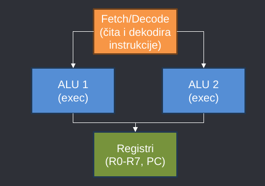{width=100%}
:::
::::::

## Superskalarni procesori

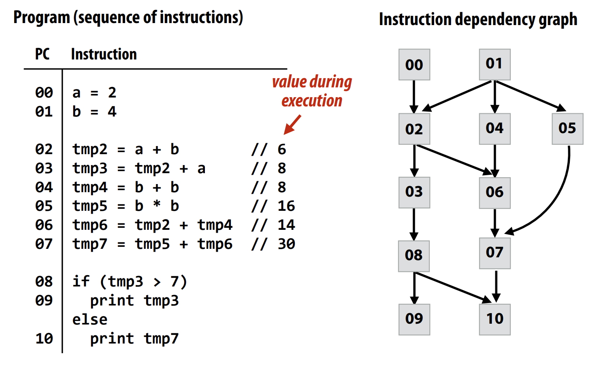{height=80%}

## Višejezgreni (Multi-core) procesor

- **Prije 2005.:** jedan složen procesor · **poslije 2005.:** više jednostavnijih jezgri
- **Zašto?** *Power wall* --- potrošnja raste s kvadratom frekvencije

:::::: columns
::: {.column width="50%"}
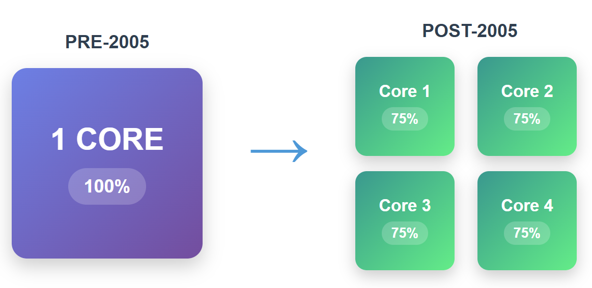{width=100%}
:::
::: {.column width="48%"}
\small

**Prije 2005.: jedan kompleksan procesor**

- **Out-of-order execution** --- izvršava instrukcije redom koji njemu odgovara, ne kako su napisane
- **Branch prediction** --- pogađa grane IF-a i spekulativno ih izvršava unaprijed
- **Velike cache memorije** --- skrivaju latenciju DRAM-a
:::
::::::

## Thread-level parallelism

:::::: columns
::: {.column width="46%"}
\small

- svaka jezgra ima: vlastiti PC, registre, L1 (32 KB) i L2 (256 KB) cache
- sve jezgre dijele: L3 cache (8--20 MB) i glavnu memoriju (DRAM)
- komunikacija među nitima preko dijeljene memorije
- alati: **OpenMP, pthreads, C++ `std::thread`**
:::
::: {.column width="52%"}
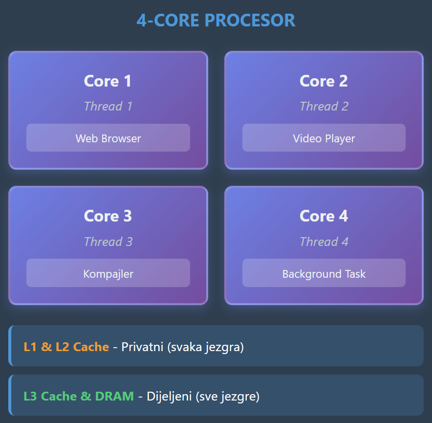{height=74%}
:::
::::::

## Tri oblika paralelizma

- **ILP** --- na razini instrukcije (automatski)
    - procesor sam pronalazi nezavisne instrukcije i izvršava ih paralelno na više izvršnih jedinica, bez intervencije programera
- **SIMD** --- na razini podataka (vektorizacija)
    - jedna instrukcija istovremeno obrađuje više podataka, idealno za jednolike operacije nad poljima (vektori, matrice)
- **TLP** --- na razini niti (eksplicitno)
    - više jezgri izvršava zasebne niti, a programer sam dijeli posao (OpenMP, pthreads)

\vspace{2ex}

\begin{center}
{\large\bfseries\color{fesbPlava}Moderni procesori kombiniraju sva tri!}
\end{center}

# Cache memorija

## Cache --- memory latency

- Procesor većinu vremena provodi **čekajući** podatke iz memorije --- vrijeme pristupa (Intel Kaby Lake, 4 GHz):

:::::: columns
::: {.column width="50%"}
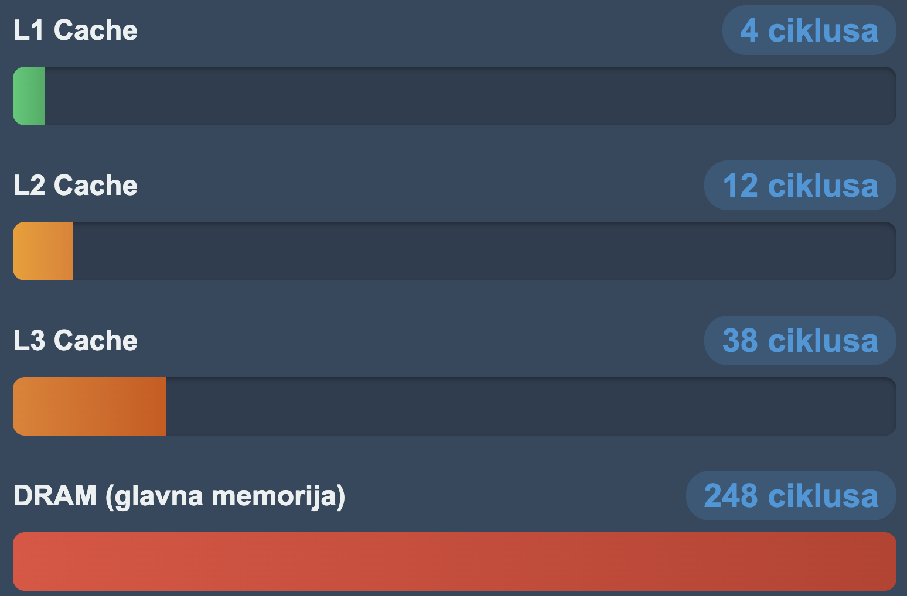{width=100%}
:::
::: {.column width="48%"}
\small

- **L1 cache** --- najbrža, direktno na procesoru: 4 ciklusa (~1 ns)
- **L2 cache** --- malo veća, malo dalja: 12 ciklusa (~3 ns)
- **L3 cache** --- još veća, dijeljena među jezgrama: 38 ciklusa (~10 ns)
- **DRAM** --- glavna memorija, gigabajti: 248 ciklusa (~62 ns)
:::
::::::

- DRAM je **~62× sporiji** od L1 cachea

## Cache line

- Cache ne radi s pojedinačnim bajtovima, nego s **blokovima** (*cache line*)
- Cache line obično 64 B (16 `int`/`float` elemenata)

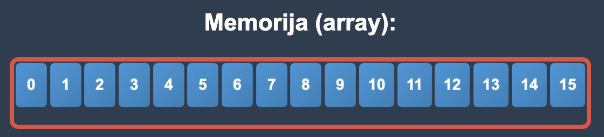{height=42%}

## Cache locality

```c
for (i = 0; i < N; i++)
    sum += array[i];

// array[i], array[i+1], array[i+2]...
// Sekvencijalno u memoriji!
```

- **Prostorna lokalnost:** pristupiš li adresi X, vjerojatno ćeš uskoro i X+1, X+2… --- npr. `array[i]`, `array[i+1]` (susjedni podaci u memoriji)
- **Vremenska lokalnost:** pristupiš li podatku sada, vjerojatno ćeš mu ponovno uskoro --- npr. `sum` u svakoj iteraciji

\vspace{1.5ex}

\begin{center}
{\large\bfseries\color{fesbPlava}Dobar programer vodi računa o organizaciji cache memorije i lokalnosti}
\end{center}

## Cache --- dobar vs. loš kod

```c
// Dobro: pristup po recima (slijedno u memoriji)
for (i = 0; i < N; i++)
    for (j = 0; j < N; j++)
        suma += A[i][j];

// Loše: pristup po stupcima (skokovi kroz memoriju)
for (j = 0; j < N; j++)
    for (i = 0; i < N; i++)
        suma += A[i][j];
```

- Isti algoritam, isti procesor --- samo drukčiji uzorak pristupa memoriji → velika razlika u brzini

## Lažno dijeljenje (*false sharing*)

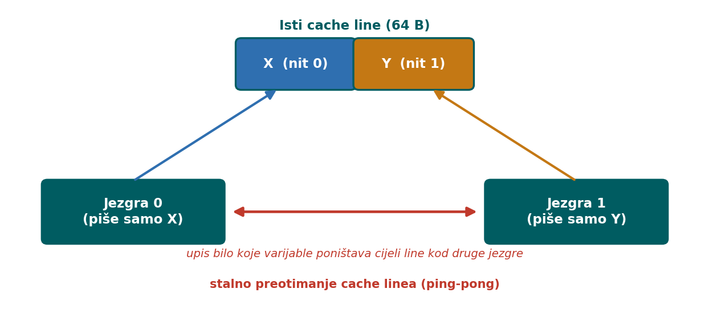{width=60%}

- Dvije niti mijenjaju **različite** varijable koje su slučajno u **istom cache lineu**
- Koherentnost radi na razini **cijelog linea**: svaki upis poništava line kod druge jezgre (**ping-pong**) → velik pad brzine iako logički nema dijeljenja
- Rješenje: **padding** / poravnanje --- svaka varijabla u svom cache lineu

# Memorijske arhitekture

## Dijeljena memorija

- Procesori izvršavaju nezavisne sljedove operacija, ali **dijele isti adresni prostor**
- *Bus-based*: svi procesori dijele istu sabirnicu

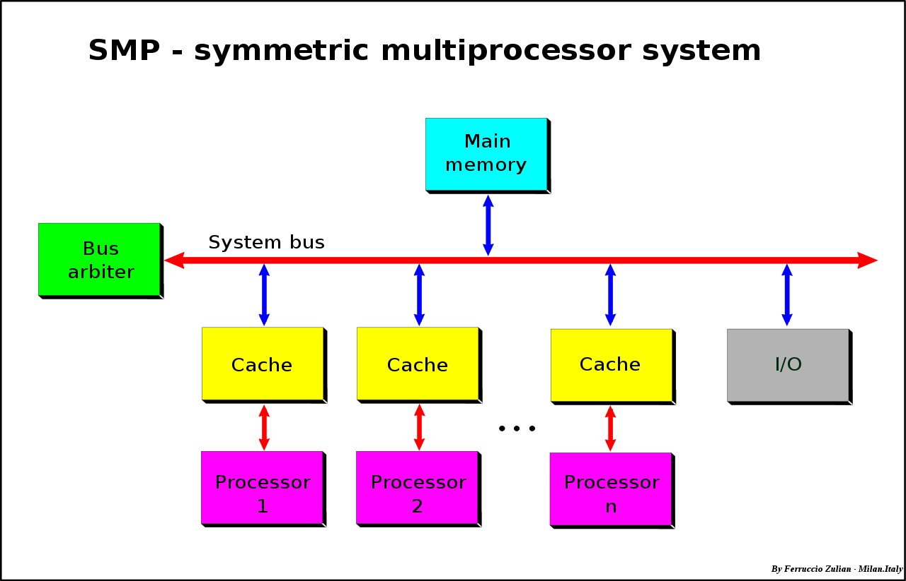{height=48%}

## NUMA

- *Non-Uniform Memory Access* --- dijeljena memorija, svi procesori vide cijeli adresni prostor
- Brzina pristupa ovisi o **lokaciji** memorije u odnosu na procesor
- Složeno i skupo za implementaciju
- **ccNUMA** (cache-coherent) --- osnova većine modernih višeprocesorskih sustava

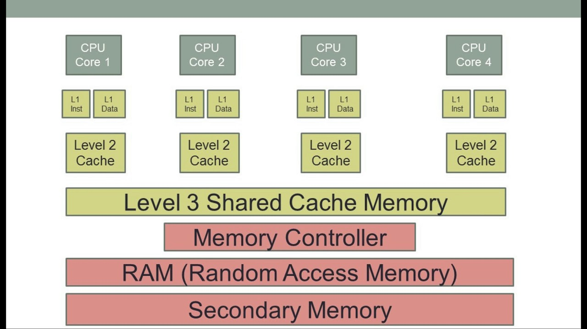{height=34%}

## Dijeljena memorija --- izazovi

- Programer mora **sinkronizirati** pristup memoriji
- **Zagušenje:** više procesora dijeli istu sabirnicu
- **Lažno dijeljenje:** sukob pri istovremenom pristupu istom bloku
- **Koherentnost cachea:** svaka promjena bloka mora se odraziti na sve kopije, inače procesori rade s nekoherentnim podacima

## Symmetric Multiprocessing (SMP)

- Dva ili više **identičnih** procesora spojenih na zajedničku glavnu memoriju
- Nema procesora posebne namjene; dijele sve U/I uređaje
- Zajednički operativni sustav
- Većina višejezgrenih računala temelji se na SMP arhitekturi

{height=36%}

## PRAM

- *Parallel Random Access Machine* --- apstrakcija računala s dijeljenom memorijom
- Koristi se za **modeliranje** paralelnih algoritama i procjenu složenosti
- Modeli pristupa:
    - **EREW** --- exclusive read, exclusive write
    - **CREW** --- concurrent read, exclusive write
    - **CRCW** --- concurrent read, concurrent write

## Distribuirana memorija

- Svaki procesor (proces) ima **vlastiti** memorijski prostor
- Dijeljenje podataka **razmjenom poruka**
- Brz pristup lokalnim podacima, spor pristup udaljenima
- Zahtjevniji razvoj: podatke i strukture treba prilagoditi modelu
- Pri razmjeni poruka oba procesa (privremeno) zaustavljaju računanje

# Mrežne arhitekture

## Mrežne arhitekture

- **Potpuno povezane mreže:** svaki čvor povezan sa svima
    - složeno i skupo; složenost komunikacije O(1)
- **Ograničeno povezane mreže:** nema direktne veze svakog sa svakim
    - komunikacija se preusmjerava kroz druge čvorove
    - **linearni niz:** složenost mreže O(N), komunikacije O(N)

## Hypercube

- N-dimenzionalna analogija kvadrata; procesori u vrhovima
- U sustavu s $2^N$ procesora svaki je povezan s **N** susjeda
- **Promjer mreže:** najmanji broj koraka do najudaljenijeg procesora → N
- Broj procesora uvijek je potencija broja 2

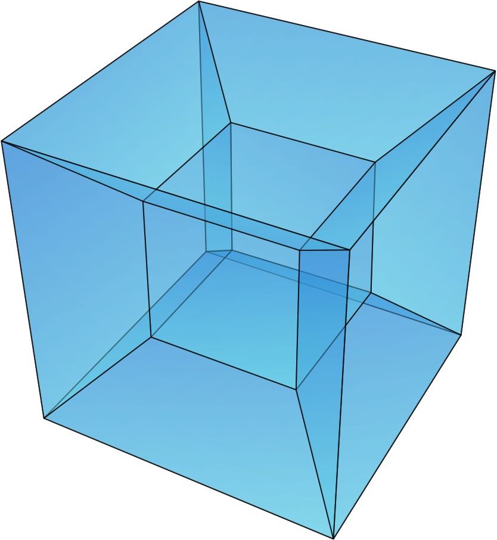{height=44%}

## Mesh (rešetka)

- *Mesh Interconnection Network* --- procesori u 2D rešetki
- Svaki procesor povezan sa **4** neposredna susjeda
- Broj procesora ne mora biti potencija broja 2
- Rubovi se mogu spojiti → **torus**

{height=40%}

## Torus

- Nastaje spajanjem rubova rešetke u zatvorenu petlju
- **1D torus (ring):** svaki čvor povezan s 2 susjeda
- **2D torus:** rešetka $n \times n$
- **3D torus:** svaki čvor povezan sa 6 susjeda
- **N-D torus:** svaki čvor povezan s 2N susjeda

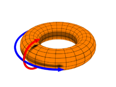{height=34%}

## Torus --- prednosti i nedostaci

- **Prednosti:** veća brzina i manja latencija, bolja balansiranost, manja potrošnja energije
- **Nedostaci:** složenost, neujednačena dužina linkova, cijena
- Primjer: Fujitsu **6D torus** --- 12× veća skalabilnost od 3D torusa
    - superračunalo **Fugaku** (~0,5 exaFLOPS, vrh TOP500 2020.--2022.)

# Sažetak

## Ključne poruke

- Flynnova taksonomija (SISD/SIMD/MISD/MIMD) klasificira arhitekture po tokovima instrukcija i podataka
- Moderni procesori kombiniraju **ILP, SIMD i TLP**, uz duboku **cache hijerarhiju**
- Dva memorijska modela: **dijeljena** (sinkronizacija, koherentnost) i **distribuirana** (razmjena poruka, topologije)

## Što slijedi

- **Dio II** --- dijeljena memorija: niti i OpenMP (Predavanja 4--7)
- **Dio III** --- distribuirana memorija: MPI (Predavanja 8--9)
- **Dio IV** --- GPU arhitekture: CUDA (Predavanja 10--11)
