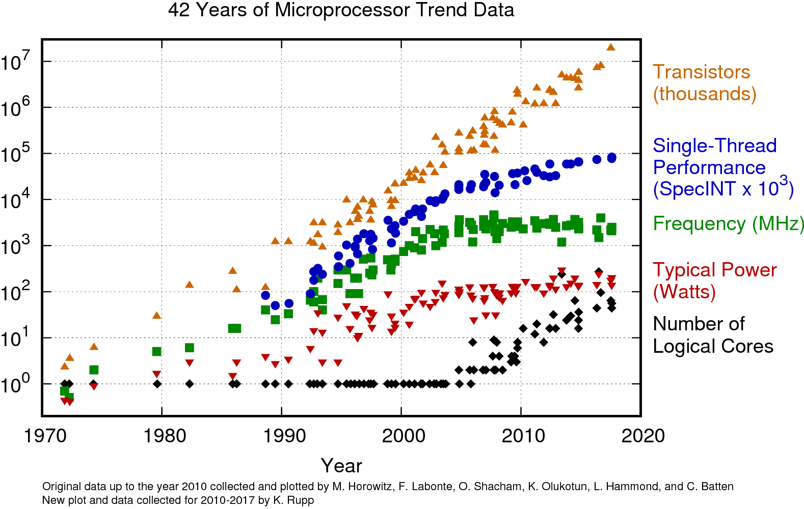
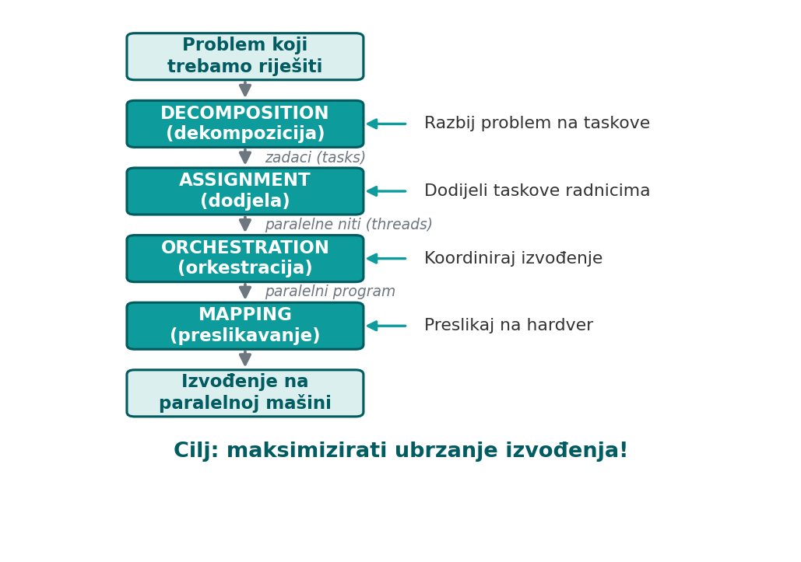
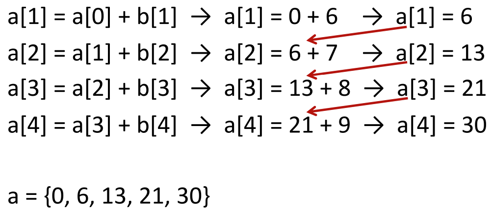
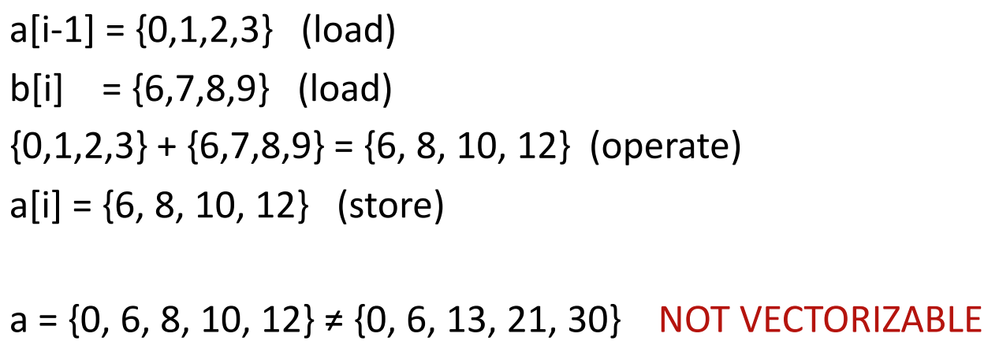
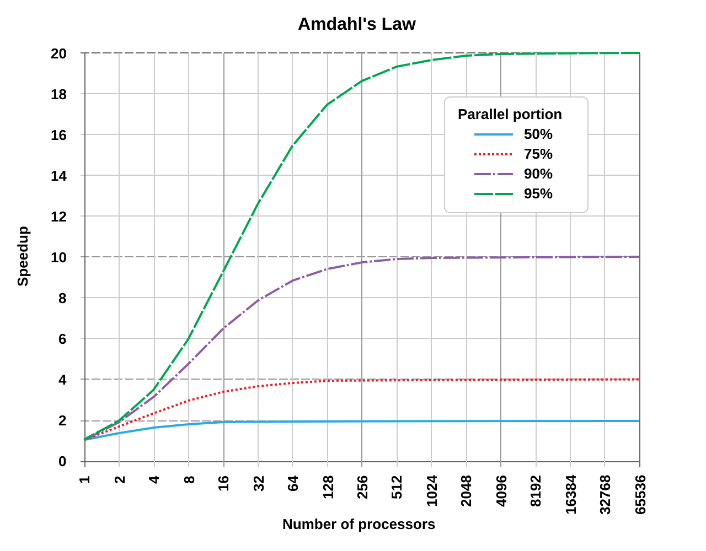
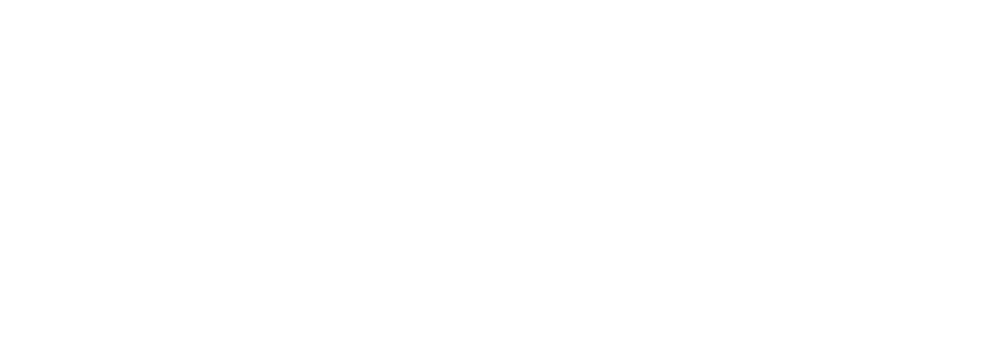
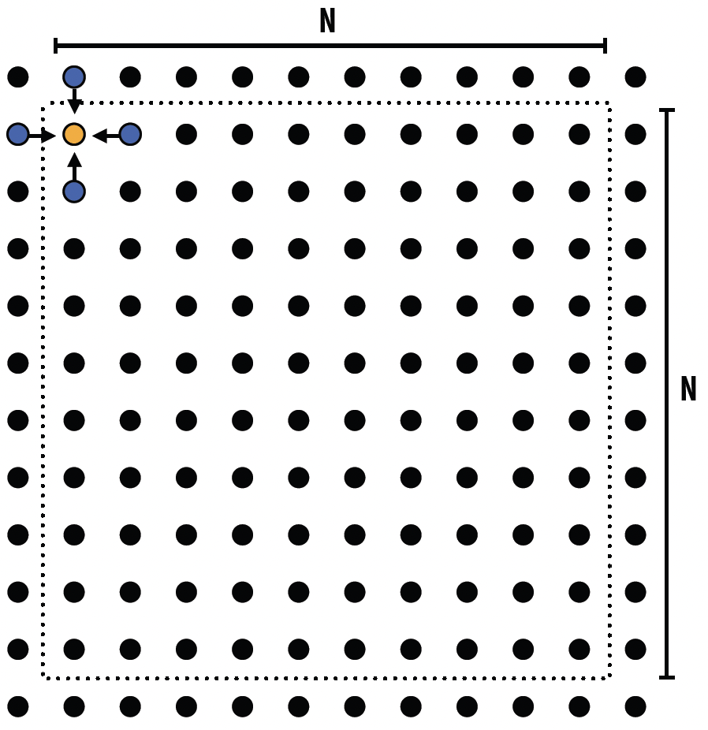
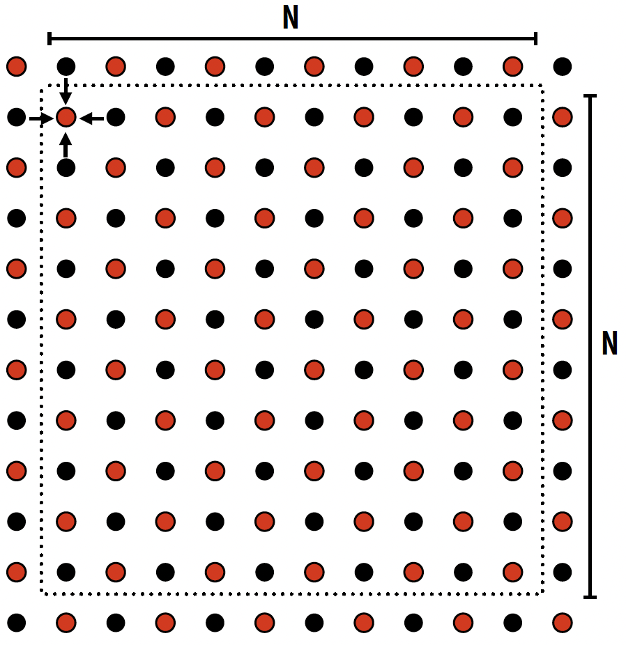

# Uvod i framework

## Zašto paralelizam?

:::::: columns
::: {.column width="40%"}
\small

- **Broj tranzistora:** i dalje raste eksponencijalno → Mooreov zakon vrijedi
- **Single-thread performanse:** jedva rastu
- **Frekvencija:** stagnira od ~2005. (3--4 GHz)
- **Snaga:** dostigla ~100 W limit
- **Broj jezgri:** raste --- novo rješenje

**Više tranzistora, ali ne brže jezgre → paralelizam!**
:::
::: {.column width="58%"}
{width=100%}
:::
::::::

## Proces izrade paralelnog programa

{height=82%}

# Dekompozicija

## Dekompozicija --- identifikacija paralelnog posla

- **Što je dekompozicija?**
    - razbijanje problema na manje jedinice posla (taskove) koje se izvršavaju neovisno ili s minimalnim zavisnostima
- Ciljevi:
    - stvoriti dovoljno taskova da sve jezgre budu zauzete
    - balansirati količinu posla po tasku
    - **minimizirati zavisnosti** (*dependencies*) između taskova
- **Tri osnovna pristupa:**
    - funkcionalna dekompozicija (*Task Parallelism*)
    - podatkovna dekompozicija (*Data Parallelism*)
    - paralelizam protočne strukture (*Pipeline Parallelism*)

## Task paralelizam

\small

**Ključne značajke:**

- **Različite operacije** --- svaka jezgra/nit izvršava drugačiju funkciju
- **Asinkrono izvršavanje** --- zadaci se pokreću i završavaju neovisno jedan o drugome
- **Podjela posla** --- velik problem se rastavlja na funkcionalno različite podzadatke

**Primjer --- videoigra (60 FPS):** 4 jezgre, 4 različita zadatka

{width=82%}

## Data paralelizam

**Ključne značajke:**

- **Ista operacija, drugi podaci** --- svi procesori izvršavaju identičan kôd, svaki na svom skupu podataka
- **Dijeljenje podataka** --- velik skup dijeli se na manje dijelove (*batches*) i šalje procesorima
- **Sinkronizacija** --- na kraju se rezultati spajaju (npr. zbrajanje gradijenata u strojnom učenju)

\begin{center}
\includegraphics[height=0.40\textheight]{slike/data_blocks.png}
\end{center}

## Pipeline paralelizam

\small

**Ključne značajke:**

- **Podjela po fazama** --- sustav se dijeli linearno (npr. slojevi mreže 1--10 na GPU 1, 11--20 na GPU 2)
- **Protočnost** (*throughput*) --- dok GPU 2 obrađuje prve podatke, GPU 1 već obrađuje sljedeći paket
- **Prazni hod** (*pipeline bubble*) --- na početku i kraju neki procesori čekaju podatke

Ključan za treniranje velikih **AI modela (LLM)** koji ne stanu u memoriju jednog GPU-a.

{width=78%}

## Identifikacija zavisnosti

- **Ključni izazov:** identifikacija zavisnosti (*dependencies*)
- Pitanja:
    - može li Task B početi prije nego Task A završi?
    - dijele li Task A i Task B podatke?
    - u kojem redoslijedu pristupaju podacima?

\vspace{1.5ex}

\begin{center}
\setlength{\fboxsep}{9pt}
\colorbox{fesbSvijetla!15}{\parbox{0.82\linewidth}{\centering
\textbf{Nezavisni} taskovi $\to$ mogu se izvršavati \textbf{paralelno}\\[4pt]
\textbf{Zavisni} taskovi $\to$ moraju se izvršavati \textbf{sekvencijalno}}}
\end{center}

# Zavisnosti podataka --- Data Dependencies

## Što su data dependencies?

- Data dependency postoji kada **redoslijed pristupa podacima** utječe na ispravnost ili rezultat programa
- Četiri tipa:
    - **RAW** (Read After Write) --- *flow / pravi* dependency → **NE** može se paralelizirati

      čitanje ovisi o prethodno zapisanoj vrijednosti (pravi lanac podataka)
    - **WAR** (Write After Read) --- *anti* dependency → često **može** paralelno

      pisanje ne smije prestići čitanje stare vrijednosti; rješivo kopijom/preimenovanjem
    - **WAW** (Write After Write) --- *output* dependency → ovisi o situaciji

      dva pisanja u istu lokaciju; konačna vrijednost ovisi o redoslijedu
    - **RAR** (Read After Read) --- nije dependency → **uvijek** može paralelno

      dva čitanja iste lokacije se ne sudaraju

## RAW --- loop-carried dependency

:::::: columns
::: {.column width="46%"}
```c
// a={0,1,2,3,4}, b={5,6,7,8,9}
for (i = 1; i < N; i++)
    a[i] = a[i-1] + b[i];
```

- svaki korak treba **rezultat prethodnog**
- **lanac zavisnosti** → ne može se vektorizirati
:::
::: {.column width="52%"}
{width=100%}
:::
::::::

## RAW --- pokušaj vektorizacije

- Vektorski (svi `i` odjednom) čita **stare** vrijednosti → pogrešan rezultat

{width=68%}

## RAW --- između taskova

```c
// Task A
x = compute_something();
// Task B
y = x + 10;   // RAW dependency na x
```

- **RAW = pravi dependency** --- ne može se ignorirati ni paralelizirati (bez algoritamske promjene)
- Compiler ga detektira i **odbija vektorizaciju**:

```text
gcc -O3 -fopt-info-vec-missed dep.c
dep.c:20: missed: couldn't vectorize loop
   data reference a[i] followed by a[i-1] → possible dependence
```

## WAR --- Write After Read

- Task B **piše** u podatak koji Task A **čita** → B ne smije prepisati prije nego A pročita

```c
for (i = 0; i < N-1; i++)
    a[i] = a[i+1] + b[i];
// i=0: a[0] = a[1] + b[0]   ← čita a[1]
// i=1: a[1] = a[2] + b[1]   ← piše a[1]
```

- nema **pravog** lanca unatrag (i=1 ne prepisuje dok i=0 čita)

## WAR --- vektorska izvedba (ispravno)

```text
Početno: a = {0,1,2,3,4}, b = {5,6,7,8,9}
Vektorski (i = 0..3):
  učitaj a[1..4] = {1,2,3,4}   ← prvo čitaj
  učitaj b[0..3] = {5,6,7,8}
  zbroji i spremi u a[0..3]
Rezultat: a = {6, 8, 10, 12, 4}
```

- **RAW:** čitamo ono što smo upravo pisali → lanac naprijed
- **WAR:** pišemo ono što smo već pročitali → nema lanca

## WAR --- između taskova

```c
// Task A            // Task B
y = x + 10;          x = new_value;   // WAR na x
```

Rješenje --- **privremena varijabla**:

```c
// Task A                 // Task B (sada paralelno!)
temp = x;                 x = new_value;
y = temp + 10;
```

## WAW --- Write After Write (Painter's algorithm)

- **Painter's algorithm:** crtamo objekte redom, kasniji prekriva ranije

```c
// slika[] — pikseli;  obj[] — objekti (redom kako se crtaju)
for (i = 0; i < N; i++)
    slika[ obj[i].piksel ] = obj[i].boja;
```

- padnu li dva objekta na isti piksel, **zadnji nacrtani pobjeđuje**
- konačna slika ovisi o **redoslijedu** → naivno paralelno = kriva slika (**WAW**)

## WAW --- rješenje: z-buffer

```c
// dubina[] — najmanja dosad viđena dubina po pikselu
for (i = 0; i < N; i++) {
    p = obj[i].piksel;
    if (obj[i].dubina < dubina[p]) {   // samo ako je bliži
        slika[p]  = obj[i].boja;
        dubina[p] = obj[i].dubina;
    }
}
```

- svaki piksel zadrži **najbliži** objekt → **redoslijed više nije bitan**
- sada se **MOŽE** paralelizirati (uz **atomičnu** usporedbu/ažuriranje po pikselu)
- to je zapravo **redukcija po pikselu** (min po dubini) --- princip GPU z-buffera

## RAR --- Read After Read

- Task A i Task B **čitaju** istu lokaciju → nema problema

```c
for (i = 0; i < N; i++)
    a[i] = b[i % 2] + c[i];
// i=0 i i=2 oba čitaju b[0] istovremeno
```

- **uvijek** može se vektorizirati / paralelizirati

## Aliasing

- U C-u pokazivači mogu pokazivati na **iste** lokacije!

```c
void compute(double *a, double *b, double *c) {
    for (i = 1; i < N; i++)
        a[i] = b[i] + c[i];
}
compute(A, B, C);    // sve odvojeno → vektorizira se
compute(A, A+1, C);  // aliasing! a[i] = a[i+1] + c[i] → WAR
```

## Aliasing --- pogled compilera

- Compiler ne zna kako će funkcija biti pozvana → pretpostavlja **najgori slučaj**
- Neće vektorizirati „za svaki slučaj" → gubitak performansi

```text
gcc -O3 -fopt-info-vec-missed compute.c
compute.c:15: missed: possible aliasing between pointers a and b
```

## Aliasing --- rješenje: `restrict`

```c
void compute(double * restrict a,
             double * restrict b,
             double * restrict c) {
    for (i = 1; i < N; i++)
        a[i] = b[i] + c[i];
}
```

- `restrict` = obećanje da se pokazivači **ne preklapaju** → compiler smije vektorizirati

```text
gcc -O3 -std=c99 -fopt-info-vec compute.c
compute.c:15: optimized: loop vectorized using 256 bit vectors
```

## Compiler reports

- Izvještaji o optimizaciji pomažu: koje su petlje vektorizirane, zašto neke nisu, koje zavisnosti postoje

```c
void test(double *a, double *b, int N) {
    for (int i = 1; i < N; i++)
        a[i] = a[i-1] + b[i];  // RAW dependency
}
```

```text
gcc -O3 -fopt-info-vec-missed dep.c
dep.c:3:5: missed: couldn't vectorize loop
dep.c:3:5: missed: data reference a[i] followed by
           data reference a[i-1] indicates a possible
           loop-carried dependence
dep.c:3:5: note: vector version of the loop was not
           generated due to probable aliasing
```

# Amdahlov zakon

## Koliko možemo ubrzati program?

- Program (ukupno vrijeme T): **S + P = 1** (100 % programa)

{width=88%}

:::::: columns
::: {.column width="50%"}
\small

**Sekvencijalno (S):**

- inicijalizacija
- U/I operacije
- zavisnosti koje ne možemo eliminirati
- sinkronizacija
:::
::: {.column width="50%"}
\small

**Paralelno (P):**

- nezavisni izračuni
- data-parallel petlje
- nezavisni taskovi
:::
::::::

## Gene Amdahl (1967)

:::::: columns
::: {.column width="60%"}
- Teorijsko maksimalno ubrzanje programa kao posljedica paralelizacije **ne može biti veće od inverza vremena izvršavanja** onog dijela programa koji je **nepromjenjivo sekvencijalan**
:::
::: {.column width="38%"}
{width=100%}
:::
::::::

$$Speedup = \frac{1}{(1-P) + P/N}$$

\footnotesize P --- paralelni udio (0<P<1) · (1−P) --- sekvencijalni dio · N --- broj procesora

## Amdahlov zakon

- Uz $n$ procesora i paralelni udio $P$:

$$S(n) = \frac{1}{(1-P) + \dfrac{P}{n}}, \qquad S_{\max} = \frac{1}{1-P}$$

- Pitanje: ako je samo 5 % koda sekvencijalno ($P = 0{,}95$), postoji li limit ubrzanja dodavanjem procesora?
- Primjer ($P = 0{,}95$, $n = 16$):

$$S = \frac{1}{0{,}05 + 0{,}95/16} \approx 9{,}17\times \qquad (S_{\max} = 20\times)$$

## Amdahlov zakon

{height=84%}

## Summit supercomputer

:::::: columns
::: {.column width="52%"}
\small

- ~148 M ALU jedinica; program S = 0.001, P = 0.999
- $S_{\max} = 1/S =$ **1 000×** --- strop, **bez obzira na broj jedinica**
- sve jedinice **mogu raditi**, ali dodatne **gotovo ništa ne doprinose** (sekvencijalni dio je usko grlo)
- potencijal stroja gotovo „protraćen"
:::
::: {.column width="46%"}
{width=100%}
:::
::::::

\small

| broj jedinica $n$ | 1 000 | 10 000 | 100 000 | 1 000 000 | 148 M |
|:--|:--:|:--:|:--:|:--:|:--:|
| ubrzanje $S(n)$ | ~500× | ~909× | ~990× | ~999× | ~1000× |

## Amdahlov zakon

- **Prednosti:**
    - jasan gornji limit performansi → znamo teoretski maksimum
    - pomaže identificirati uska grla → gdje fokusirati optimizaciju
    - koristan za odluke o hardveru/softveru (isplati li se više procesora?)
- **Nedostaci:**
    - pretpostavlja **fiksan** sekvencijalni dio → u praksi se ponekad može smanjiti, $(1-P)$ nije uvijek konstantan
    - pretpostavlja **identične** procesore → ne vrijedi u heterogenim sustavima (GPU+CPU, big.LITTLE)
    - zanemaruje faktore stvarnog svijeta: komunikaciju, sinkronizaciju (*locks, barriers*), load balancing, cache coherency, memory bandwidth

## Gustafson-Barsisov zakon (1988)

:::::: columns
::: {.column width="58%"}
- Što ako **povećamo problem** umjesto broja procesora?
- **Amdahl:** ubrzanje ograničeno sekvencijalnim dijelom, bez obzira na broj procesora
- **Gustafson:** ako skaliramo problem s brojem procesora, možemo postići **gotovo linearno** ubrzanje
- Oba zakona su točna --- vrijede za različite scenarije!
:::
::: {.column width="40%"}
{width=100%}
:::
::::::

## Gustafson-Barsisov zakon

- **Amdahl** gleda **fiksnu** veličinu problema: „koliko brže isti posao na više procesora?"
- **Gustafson** mijenja pitanje: s više procesora rješavamo **veći** problem u **istom vremenu**
- Skalirano ubrzanje: $S(n) = s + p \cdot n \quad (s + p = 1)$
- Ključno: sekvencijalni dio ostaje ~fiksan, a **paralelni dio raste s problemom**
    - udio sekvencijalnog pada → **gotovo linearno** ubrzanje

## Gustafson-Barsis i superračunala

- **Primjer (prognoza vremena):** s više procesora ne računamo istu prognozu **brže**, nego **finiju mrežu** --- veću rezoluciju i više dana unaprijed --- u istom vremenu
- Slično: simulacije klime, aerodinamika (CFD), renderiranje, treniranje AI modela
- Zato **ima smisla graditi superračunala** s ogromnim brojem procesora:
    - problemi **rastu** s dostupnom snagom → masivni paralelizam se isplati
    - (za razliku od Amdahlovog pesimizma za problem **fiksne** veličine)

# Assignment

## Assignment

- **Assignment** = dodjela taskova radnicima (*workers*); workers mogu biti:
    - niti (*threads*)
    - procesori / jezgre
    - vektorske trake (*vector lanes*)
    - GPU blokovi
- Ciljevi:
    - balansirati radno opterećenje --- svi workeri podjednako zauzeti
    - smanjiti troškove komunikacije --- taskovi koji komuniciraju blizu jedan drugom
    - očuvati lokalnost podataka --- minimizirati pristup udaljenim podacima
- Dva pristupa:
    - **static** assignment (prije izvođenja)
    - **dynamic** assignment (tijekom izvođenja)

## Static assignment

- Odluke o dodjeli napravljene **prije** izvođenja programa
- Primjeri:
    - **blocked** --- nit 1 dobiva prvih N/2 elemenata
    - **interleaved** --- nit 1 parne, nit 2 neparne indekse
    - **block-cyclic** --- blokovi od B elemenata, naizmjenično
- Prednosti:
    - nema runtime overhead-a
    - predvidljivo
    - jednostavno za implementirati
- Nedostaci:
    - ne prilagođava se neravnoteži opterećenja (*load imbalance*)
    - loše ako taskovi različito dugo traju

## Dynamic assignment

- Odluke o dodjeli napravljene **tijekom** izvođenja
- Primjeri:
    - **task queue** --- radnici uzimaju taskove iz zajedničkog reda
    - **work stealing** --- neaktivni radnici „kradu" posao od zauzetih
- Prednosti:
    - automatski balansira opterećenje
    - prilagođava se razlikama u trajanju taskova
- Nedostaci:
    - runtime overhead (sinkronizacija)
    - složenije za implementirati

## Primjer: grid solver

:::::: columns
::: {.column width="54%"}
\small

- iterativno rješavanje **parcijalnih diferencijalnih jednadžbi (PDE)** na mreži (N+2)×(N+2)
- primjene: raspodjela **topline** po ploči, strujanje **fluida**, **elektrostatski** potencijal
- **Gauss-Seidel:** ponavljaj prolaze dok ne konvergira; svaka ćelija = težinski prosjek sebe i 4 susjeda
:::
::: {.column width="44%"}
{width=82%}
:::
::::::

$$A[i,j] = 0{,}2 \cdot \big(A[i,j] + A[i{-}1,j] + A[i{+}1,j] + A[i,j{-}1] + A[i,j{+}1]\big)$$

## Red-black paralelizacija

:::::: columns
::: {.column width="54%"}
\small

- ćelije obojimo kao šahovnicu → crvena ima samo crne susjede i obrnuto
- **Faza 1:** ažuriraj sve **crvene** paralelno (susjedi su crni, još stari → nema sukoba)
- **barijera**, pa **Faza 2:** ažuriraj sve **crne** paralelno (susjedi crveni → već ažurirani)
- ponavljaj dok ne konvergira
:::
::: {.column width="44%"}
{width=70%}
:::
::::::

\begin{center}
\setlength{\fboxsep}{8pt}
\colorbox{fesbSvijetla!15}{\parbox{0.92\linewidth}{\centering \small
Red-black mijenja \textbf{redoslijed} ažuriranja (pa i međuvrijednosti), ali konvergira na \textbf{isto rješenje}; za razliku od klasičnog Gauss-Seidela \textbf{omogućuje paralelizam} --- unutar svake boje nema zavisnosti.}}
\end{center}

## Grid solver --- statički i dinamički assignment

- retci (ili blokovi) mreže = taskovi koje dodjeljujemo radnicima (nitima)

:::::: columns
::: {.column width="50%"}
\small

**Statički** (unaprijed):

- *blocked*: gornja / donja polovica
- *interleaved*: parni / neparni retci
- **prirodan izbor ovdje** --- posao je uniforman (svaka ćelija isti izračun)
:::
::: {.column width="50%"}
\small

**Dinamički** (task queue):

- retci / blokovi u zajedničkom redu; radnik uzima sljedeći kad završi
- **kad posao varira** --- adaptivna mreža, rana konvergencija, heterogene jezgre
:::
::::::

\begin{center}
\setlength{\fboxsep}{7pt}\small
\colorbox{fesbSvijetla!15}{\parbox{0.9\linewidth}{\centering red-black \textbf{omogućuje} paralelizam; statički i dinamički su dvije \textbf{strategije raspodjele} tog posla}}
\end{center}

# Orchestration

## Orchestration

\small

- **Orchestration:** strukturiranje komunikacije i sinkronizacije između taskova
- Uključuje:
    - strukturiranje komunikacije (kako taskovi razmjenjuju podatke?)
    - dodavanje sinkronizacije (očuvati zavisnosti)
    - organiziranje podatkovnih struktura u memoriji (performanse)
    - raspoređivanje taskova (kada koji task izvršiti?)
- Ciljevi:
    - smanjiti troškove komunikacije i sinkronizacije
    - očuvati lokalnost podataka
    - smanjiti overhead

\begin{center}
\setlength{\fboxsep}{7pt}
\colorbox{fesbSvijetla!15}{\parbox{0.72\linewidth}{\centering \textbf{Detalji o hardveru utječu na odluke!}}}
\end{center}

## Model 1: Data-parallel (implicitna sinkronizacija)

```c
for_all (i = 0 ... N) {   // paralelna konstrukcija
    a[i] = b[i] + c[i];
}                          // implicitna barijera
```

- programer opisuje **što** učiniti nad **svim** podacima, ne **kako** podijeliti posao
- sustav/prevoditelj sam raspoređuje iteracije na radnike
- **sinkronizacija je implicitna:** nakon konstrukcije automatska barijera (nema ručnih lockova)
- ugrađeni primitivi za česte obrasce: `map`, `reduce`, `scan`
- primjeri: **OpenMP parallel for, CUDA kerneli, ISPC foreach**

## Model 2: Shared address space / SPMD

```c
// Thread 1                        // Thread 2
for (i=0; i<N/2; i++)              for (i=N/2; i<N; i++)
    a[i] = b[i]+c[i];                  a[i] = b[i]+c[i];
barrier();                         barrier();  // eksplicitno!
```

- **Karakteristike:**
    - više niti izvršava **isti kod** (SPMD)
    - programer je odgovoran za sinkronizaciju
    - eksplicitni lock-ovi i barijere
    - komunikacija kroz dijeljenu memoriju
    - fleksibilnije, ali složenije
- Primjeri: **pthreads, C++ threads, OpenMP tasks**

## Sinkronizacijski primitivi --- lock

**Lock --- međusobno isključivanje (*mutual exclusion*)**

```c
lock(my_lock);
x = x + 1;        // kritični odsječak - samo jedna nit
unlock(my_lock);
```

- **svrha:** samo jedna nit pristupa dijeljenom resursu
- kada: ažuriranje dijeljene varijable, zaštita kritičnih odsječaka

## Sinkronizacijski primitivi --- barrier

```c
compute_phase1();
barrier();          // čekaj da svi završe
compute_phase2();
```

- **svrha:** sinkronizirati sve niti na određenoj točki
- **Kada koristiti:**
    - razdvajanje faza računanja
    - osiguravanje da su svi podaci spremni prije sljedeće faze
    - globalna sinkronizacija

## Sinkronizacijski primitivi --- semafor

```c
semaphore_wait(sem);    // smanji brojač; čekaj ako je 0
// pristup resursu
semaphore_signal(sem);  // povećaj brojač
```

- **svrha:** ograničiti broj niti koje istovremeno pristupaju resursu (brojač dozvola)
- **kada koristiti:**
    - ograničen broj resursa (npr. N konekcija, bufferi)
    - proizvođač-potrošač (broj punih / praznih mjesta)
    - generalizacija locka (lock = semafor s 1 dozvolom)

## Sinkronizacijski primitivi --- atomske operacije

```c
atomic_add(&counter, 1);               // nedjeljivi increment
atomic_compare_swap(&p, staro, novo);  // CAS
```

- **svrha:** operacija se izvrši **nedjeljivo**, bez zaključavanja
    - **sve ili ništa:** izvršit će se **svi** koraci koji čine operaciju, ili **nijedan**
    - npr. `counter++` je zapravo *učitaj → uvećaj → spremi*; atomarno se ta tri koraka ne mogu isprekidati drugom niti
- **kada koristiti:**
    - jednostavna ažuriranja dijeljenih brojača / zastavica
    - lock-free strukture podataka
    - brže od locka za sitne operacije (nema overhead-a zaključavanja)

# Sažetak

## Ključne poruke

- Paralelni program gradimo kroz: **dekompozicija → assignment → orchestration → mapping**
- **Zavisnosti** (RAW/WAR/WAW/RAR) određuju što se smije paralelizirati; `restrict` pomaže compileru
- **Amdahl** postavlja gornji limit (sekvencijalni dio), **Gustafson** pokazuje skaliranje s veličinom problema

## Što slijedi

- **Dio II** --- arhitekture s dijeljenom memorijom: niti, OpenMP (Predavanja 4--7)
- **Dio III** --- MPI (Predavanja 8--9) · **Dio IV** --- GPU/CUDA (Predavanja 10--11)
